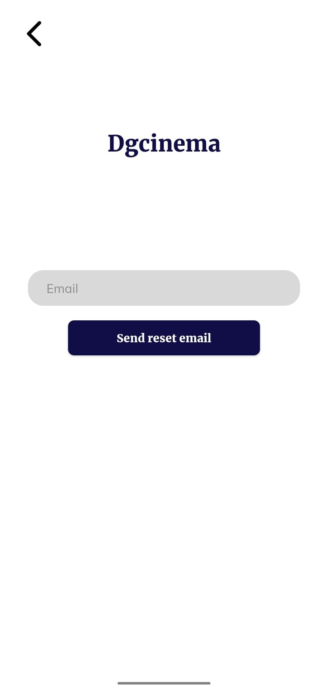
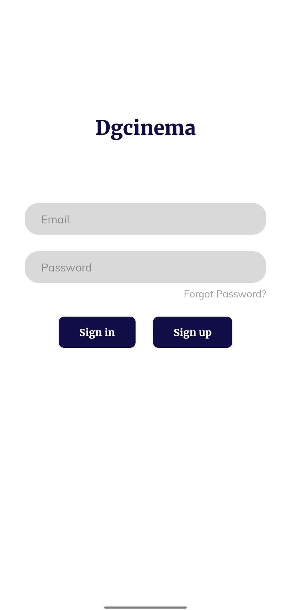
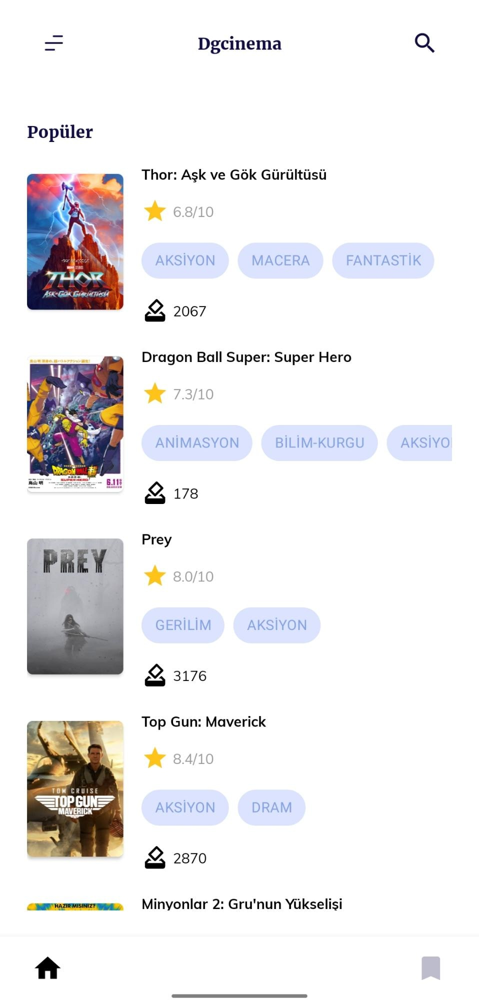
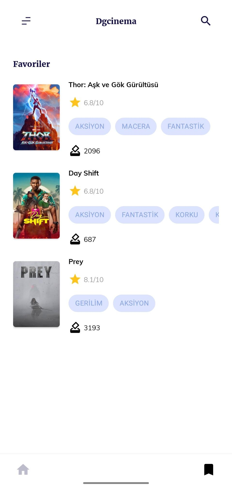
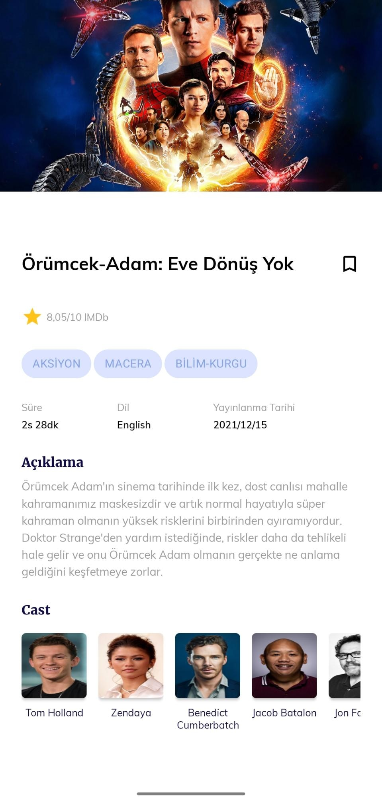

## Final Project Dökümantasyon

Uygulama testi için hazır oluşturulmuş üyelik

- Email: alperen.erdogan.neu@gmail.com
- Password: 123456

Figma linki
- https://www.figma.com/file/GVFro1UqDe1SwN76mCMd9F/Dgakademi-Movie-Mobile-App-UI-Design-(Community)?node-id=0%3A1

Özellikler
- Film detayı, login, register ve forgot password işlemlerinde ProgressBar, ana sayfada ise shimmer bulunmakta.
- Kaydedilen filmler Firebase Database ortamında tutulmakta.

### Ekran Görüntüleri

#### Database
- User id altında movie id ler saklanır.

#### Sign In ve Sign Up Sayfası
- Email ve parola alanları doldurulduktan sonra sign in veya sign up olunur.

#### Forgot Password

#### Homepage

#### Bookmarks

#### Movie Detail

