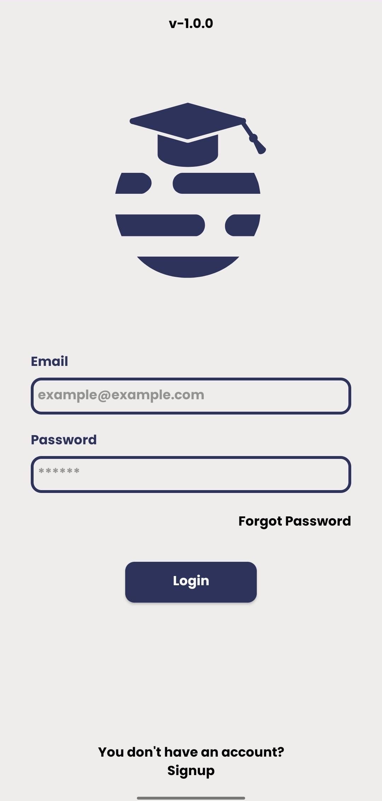
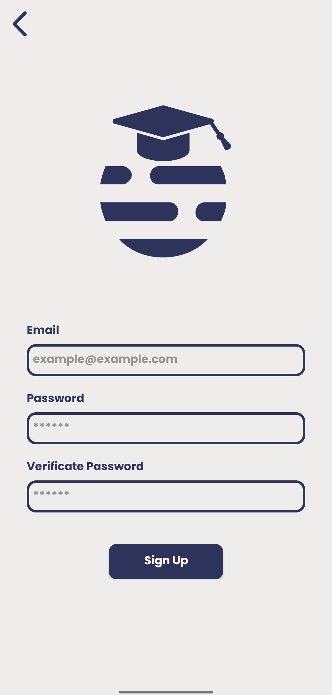
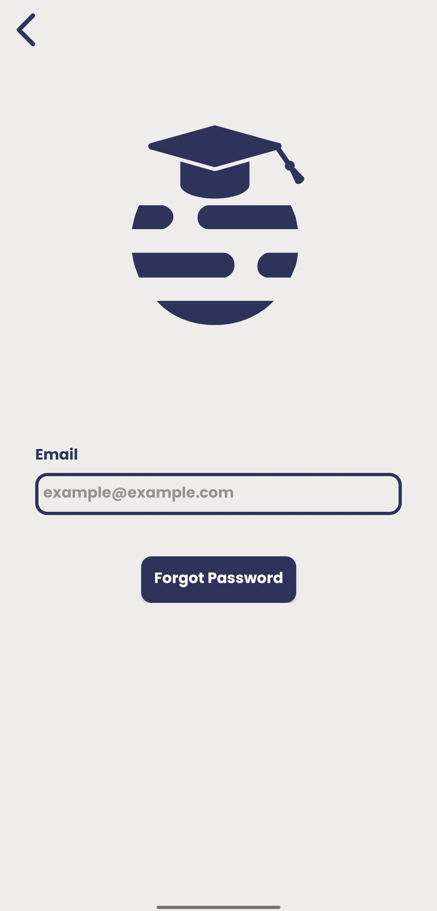
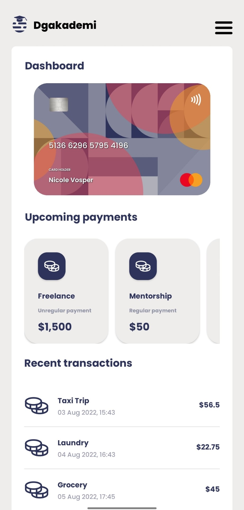
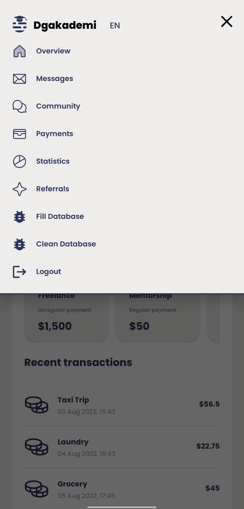

## W-02 Dökümantasyon

Uygulama testi için hazır oluşturulmuş üyelik

- Email: alperen.erdogan.neu@gmail.com
- Password: 123456

Sağlanması gereken koşullar

- Tasarıma uyarak pixel-perfect tasarım çıkarmanız. 
- Authentication işlemlerini firebase email ile hallederek signup-login-forgotpassword sayfalarını yazmanız. 
- Homepage tasarımını çıkarmanız. 
- Upcoming payments alanındaki itemlara tıklayınca tasarımdaki popupdaki alanların doldurulması. 
- Dashboard alanındaki kredi kartı alanı yatay düzende kaydırılabilir bir halde olacaktır. 
- Upcoming payments itemları yatay düzende kaydırılabilir olacaktır. 
- Recent transaction alanındaki veriler dikey düzende kaydırılabilir olacaktır. 
- Kredi kartı alanındaki arkaplan görseli hazır kullanılabilir fakat kart numarası ve holdername dinamik modelden gelecektir. 
- Diğer tüm itemlardaki veri alanları dinamik modelden gelecektir. 
- Modelleri fake data ile doldurabilirsiniz, bu fake datalar bir kere create edilip room-database aracılığıyla getirilmesi gerekmekte. 
- Açılır kapanır menu custom tasarım olması gerekmektedir. 
- Menüdeki alt sayfaların yapılması zorunlu değildir. 

Ek olarak eklenen özellikler
- Menü içerisindeki her view üzerinde bir click eventi bulunmakta. Fakat sayfalar boş. 
- Menü içerisinden database temizlenebilir veya doldurulabilir. Bu veriler W03Util classı içinden gelmektedir. 
- Auth state splash ekranı içerisinde kontrol edilmekte. Eğer daha önceden giriş yapılmışsa ana sayfaya yönlendirilir. 
- Network işlemlerinde loading animasyonu. 
- Tüm edittextler için dinamik bir biçimde doluluk kontrolü. 

### Ekran Görüntüleri

#### Splash

#### Sign In

#### Sign Up

#### Forgot Password

#### Homepage

#### Homepage Menu design

